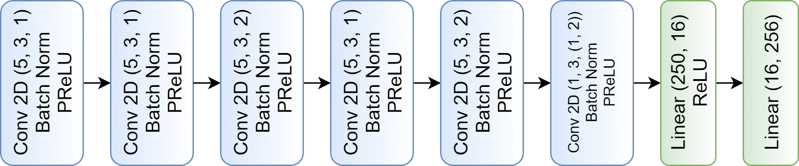

# ITU Beam Selection Challenge

###### This repo contains our submission for the ITU Artificial Intelligence/Machine Learning in 5G Challenge1, particularly the ML5G-PHY [beam selection] task.

## Authors
<b>Team Name:</b> Imperial_IPC1

<b>Supervising faculty member</b>: Prof. Deniz Gunduz, Imperial College London, Email: d.gunduz@imperial.ac.uk

<b>Team members</b>:
* Dr. Mahdi Boloursaz Mashhadi (PostDoc Team Leader), Imperial College London, Email: m.boloursaz-mashhadi@imperial.ac.uk
* Mr. Tze-Yang Tung, Imperial College London, Email: tze-yang.tung14@imperial.ac.uk
* Mr. Mikolaj Jankowski, Imperial College London, Email: mikolaj.jankowski17@imperial.ac.uk
* Mr. Szymon Kobus, Imperial College London, Email: szymon.kobus17@imperial.ac.uk

## Dataset
In this work we use Raymobtime2 dataset, which is a collection of realistic ray-tracing data obtained by simulating traffic in environment highly inspired by real world data. It utilizes SUMO for mobility simulations, Insite for ray-tracing, Cadmapper and Open Street Map for importing realistic outdoor scenarios. The dataset is divided into smaller sets, with different frequencies considered, various number of receivers, and environments. For our Challenge submission, we trained on the s008 dataset (we combined both training and validation subsets) and validated on s009. 

## Model

Our NN architecture consists of 6 convolutional layers followed by
a 2 layer linear classifier as depicted in the Figure above. In the convolutional
layers, we vary the value of stride between 1 and 2, depending on
whether we intend to downscale the intermediate features, or not. We
apply batch normalization and PReLU (Parametric Rectified linear
Unit) after each convolutional layer. The first linear layer is followed
by ReLU (Rectified linear Unit) activation, and Softmax is used at
the output to obtain the predictions. 

Our network consists of only 7460 parameters, therefore it can be trained very quickly, asd easily adjusted
to many distributed learning scenarios.

## Federated learning

We also consider training our model in the federated learning paradigm, where connected vehicles collaborate to train
to train the network. We consider each vehicle gathers it's own dataset of LIDAR measurements and corresponding
beam ground truths and runs a few training iterations, which is followed by sending a gradient update to the
base station. This significantly reduces the communication overhead as instead of heavyweight point clouds
we only transmit lightweight neural network gradients.

## Results

 Model        | Top-10 accuracy | Top-10 throughput ratio | FLOP count   | Number of trainable parameters |
|--------------|-----------------|-------------------------|--------------|--------------------------------|
| Baseline [4] | 83.52%          | 0.8415                  | 179.01 × 106 | 179.01 × 106                   |
| Proposed     | 91.17%          | 0.9478                  | 1.72 × 106   | 7.46 × 106                    |

Our model achieves superior performance compared to the baseline4, when trained offline, while also achieving
55x reduction in the number of parameters and 100x reduction in the number of FLOPs required to run the forward pass.

In the federated scenario, our model is able to achieve a satisfactory performance even for a reasonable
number of participating vehicles, denoted as V. The loss in the accuracy is caused by the fact that the local datasets
available at the vehicles are not IID, which is generally harmful to deep neural networks.
Our ongoing work aims at finding a better way to train our network in the federated manner.

## Questions?
If you have any further questions related to this repo, feel free to contact me at mikolaj.jankowski17@imperial.ac.uk or raise an Issue within this repo. I'll do my best to reply as soon as possible.
   
## References
1. Challenge website: https://www.itu.int/en/ITU-T/AI/challenge/2020/Pages/default.aspx
2. Raymobtime dataset: https://www.lasse.ufpa.br/raymobtime/
3. A. Klautau, P. Batista, N. González-Prelcic, Y. Wang and R. W. Heath Jr., “5G MIMO Data for Machine Learning: Application to Beam-Selection using Deep Learning” in 2018 Information Theory and Applications Workshop (ITA).
4. A. Klautau, N. González-Prelcic and R. W. Heath Jr., “LIDAR Data for Deep Learning-Based mmWave Beam-Selection” in IEEE Wireless Communications Letters, vol. 8, no. 3, pp. 909-912, June 2019.
